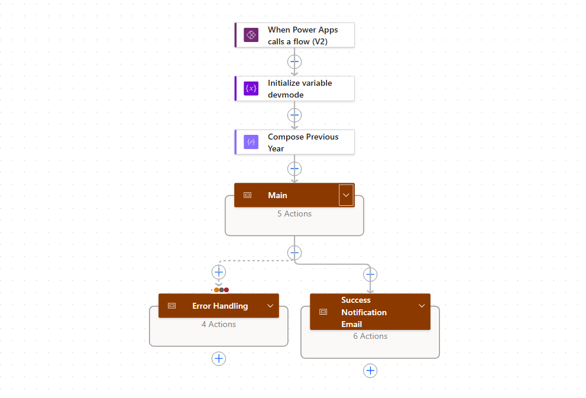

## Introduction
During the Summer 2026 Work term, I interned at Manulife Canada as a Data Analyst Intern. I worked on a team that essentially functioned as internal company contractors, taking on assignments from other teams in order to support various deliverables related to operations, automation and data analytics.

Through this report, I intend to outline my goals entering the position, and how well I feel I fulfilled them, as well as going over a few major projects that I worked on, in accordance with Manulife's confidentiality policies.

## About Manulife (John Hancock)
Manulife is Canada's largest insurance provider, and is partnered with John Hancock across the border into the United States. In Canada, its first sitting president was actually John A. MacDonald, Canada's first prime minister. (Back then, they didn't have laws against that). Here, it is primarily thought of as an insurance provider, but it actually has a large wealth management and investments side to it as well. Manulife is an extremely AI-forward company, and works to leverage AI for predictive analytics, as well as analysis of certain types of data.

## Goals
In accordance with the University of Guelph Learning Goals categories, I had four general goals that I brought into this role with me:
1. Successfully apply Power Suite tools to standardize and integrate data for report automation
   > Prior to this role, I only had some experience with Power Suite in personal use cases. I had never used it in a professional setting, nor in my classes. Upon beginning in my role at Manulife, I had to learn through a combination of recorded training and hands-on development. I learned quickly, and was able to take the primary role in development of the Quarterly Executive Summary automation, which involved thorough use of Power BI, as well as Power Apps.
2. Develop strong informational literacy skills through examination of data sources, noting discrepancies
   > Through the course of my work on the Quarterly Executive Summary, I noticed several mismatches between previously reported values, and the actual sources of data involved. I handled these issues on a case-by-case basis, recording all combinations of filters and queries used, in order to explain most clearly how these values were likely impossible. Additionally, I grew familiar with the expected behaviour of several different tracked values, and could tell when something 'felt' wrong enough to give it a closer look.
3. Employ my preexisting strong communicative skills to communicate between technical leads and business-oriented stakeholders
   > During my work on a letter automation project, in which I and another developer worked to cut out the hours per cycle spent compiling and comparing contact information across various sources, we ran biweekly sprint reviews with stakeholders in order to ensure progress remained on track, as well as answering any questions and reorienting in order to ensure the project continued to be intuitive for a business-oriented user. Due to complications with launch, we cannot yet tell how users will find ease of interaction with the live app. However, we have held demos and beta tests, and beyond a simple tutorial, little explanation was needed in order to understand what the app and corresponding automations were doing. Furthermore, I wrote extensive documentation covering expected behaviour, dependencies and troubleshooting in case of errors.
4. Behave in an ethical manner regarding informational security, collaboration and communication
   > This goal was the most broad in intent, and was fulfilled through meeting deadlines and expectations, to collaboration and networking. My feedback so far has reflected a high degree of competence and ability to learn, and I have learned and observed Manulife's security guidelines regarding personal information and proprietary data. However, I still have room for improvement when it comes to networking and socialization. In order to tackle this, I have formed an action plan prioritizing coffee chats with various members of the company across the end of my first term and moving into the second. I am working with my supervisor and mentors to set these up in order to practice my speaking skills. I have met deadlines consistently, with only one deviation during the Letter Automation project due to an unforeseen update to Microsoft's Power Platform. However, we recovered from this and have since queued the project to be moved into production.

## Major Projects

### Private Markets Letter Automation
At Manulife, as well as many other companies, there are per-cycle menial tasks that can be effectively automated to save time for employees and business partners. This project aimed to reduce the time needed for active involvement by Manulife employees, skipping compilation and comparison of records and only needing manual intervention when mismatches were found.

*A rolled-up example of a workflow I created for the Letter Automation Project, with a split notification system at the end of the flow.*

This project was constructed entirely from scratch, and I was brought on board right at the end of the planning phase. My portion of the project was executed primarily through Microsoft Power Automate, constructing several key workflows that are triggered at various points throughout the process. The outputted letters are then accessible by a select group of employees who can use them rather than writing them by hand. This project has been received well by various stakeholders and multiple enhancements have already been proposed.

* * *

### QOR Report Automation
The other major project I took on this summer was an in-depth modification of the current Monthly Executive Summary to transform it into a high-level Quarterly summary that will be distributed to employees across Manulife's Global Wealth and Asset Management (GWAM) Operations division. The report tracks various KPIs, separated into Canada, US-GA and OA geographies, in order to give the most information regarding the individual sectors' performance.

*If there is no image here, it is because I could not get one of the project that wasn't confidential.*

Being the first project that I tackled at Manulife, I did much of my hands-on learning in Power BI during this project. I learned about queries and filters on the technical side, but also had to study effective data visualizations in order to make it accessible to a wide audience. Additionally, as I worked, I was comparing my visualisations to the previous quarterly reports that were manually generated, and discovered several discrepancies in the data. Through this, I learned about escalation practices and gained a greater understanding of the data I was working with, as well as Power BI and SQL.

## Conclusion
Overall, this term was the first major step in my growth as a data analyst and data scientist. I got to learn a lot about the Microsoft Power Suite, going from almost no experience to working with it on a daily basis. I learned about networking and the corporate workflow, as this term was my first spent working at a large company. I learned about automation planning, refactoring and Agile development. And as I move into the new term, I am now learning about Agentic AI applications and Copilot Studio. All of these tools are ones I can take into future work terms, and will help me grow as a programmer and as a worker in general.
